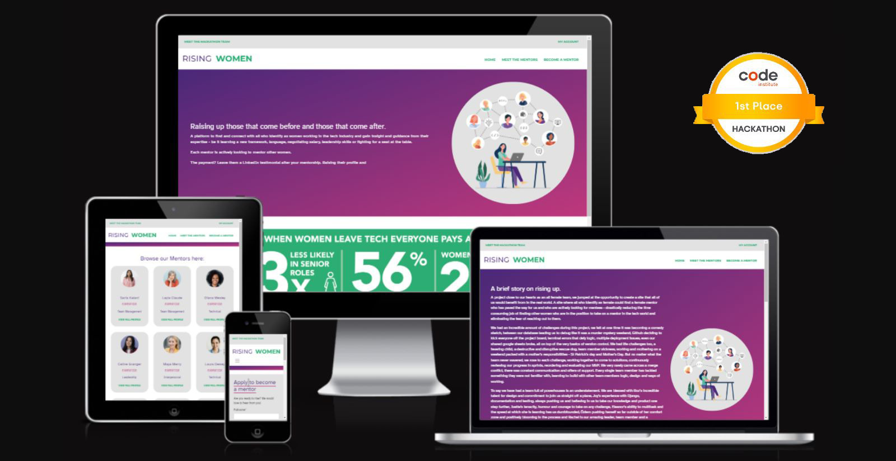

# **Rising Women Testing Results**



**[Link to the deployed/ live site](https://rising-women.herokuapp.com/)**

---
## TABLE OF CONTENTS

* [Automated Testing and Validation](#automated-testing-and-validation)
    * [HTML Validation](#html-validation)
    * [CSS Validation](#css-validation)
    * [JavaScript Validation](#javascript-validation)
    * [Python Validation](#python-validation)
    * [Lighthouse Report](#lighthouse-report)
        * [Desktop](#desktop)
        * [Mobile](#mobile)
    * [WAVE Web Accessibility Evaluation Tool](#wave-web-accessibility-evaluation-tool)
    * [Django Automated Testing](#django-automated-testing)
        * [Coverage](#coverage)
* [Manual Testing](#manual-testing)
    * [Testing User Stories](#testing-user-stories)
    * [Full Testing](#full-testing)
* [Bugs, Errors & Solutions](#bugs-found-during-testing-and-development-phase)
    * [Solved Bugs](#solved-bugs)
    * [Known Bugs](#known-bugs)
---

## Automated Testing and Validation
### HTML Validation
We used [W3C Markup Validation Service](https://validator.w3.org/) to validate all the HTML files by direct input:
| Page | Result | Validation Details & Screenshots |
| ---- | :-: | -------------------------- |
| index.html | [add-here-if-error-number] error and [add-here-if-warning-number] warning | [add-here-validation-image] |

### CSS Validation
We used [W3C CSS Validation Service](https://jigsaw.w3.org/css-validator/) to validate all CSS files by direct input.
| File | Result | Test Details & Screenshots |
| ---- | :-: | -------------------------- |
| static/css/base.css | [add-here-if-pass] | [add-here-validation-image]

### JavaScript Validation
We used [JSHint](https://jshint.com/) to validate all JavaScript and JQuery files
| Page | Result | Test Details & Screenshots |
| ---- | :-: | -------------------------- |
| [add-here-js-file-path] | [add-here-if-error-number] error and [add-here-if-warning-number] warning | [add-here-validation-image] |

### Python Validation
At the project inception, we installed [PyCodeStyle](https://pycodestyle.pycqa.org/en/latest/intro.html#configuration) in our workspace fixed errors when encountered throughout the development process. We also used [Code Institute's Python Linter](https://pep8ci.herokuapp.com/) to lint our Python code.
| File | Result | Validation Details & Screenshots |
| :-- | :-: | -------------------------- |
| [add-here-py-file-name] | [add-here-if-all-clear--no-errors-found] | [add-here-validation-image] |

### Lighthouse Report
[Chrome DevTools' Lighthouse](https://developer.chrome.com/docs/lighthouse/overview/) was used to test the performance, accessibility, best practices and SEO of the site
#### Desktop
| Page | Performance (%) | Accessibility (%) | Best Practices (%) | SEO (%) | If score is below 90% |
| :-- | :-: | :-: | :-: | :-: | :-- |
| [add-here-page-name](add-here-link-to-page-validation-screenshot) | [add-here-performance-score] | [add-here-accessibility-score] | [add-here-best-practices-score] | [add-here-seo-score] | [add-here-rationale-if-below-80-percent] |
#### Mobile
| Page | Performance (%) | Accessibility (%) | Best Practices (%) | SEO (%) | If score is below 90% |
| :-- | :-: | :-: | :-: | :-: | :-- |
| [add-here-page-name](add-here-link-to-page-validation-screenshot) | [add-here-performance-score] | [add-here-accessibility-score] | [add-here-best-practices-score] | [add-here-seo-score] | [add-here-rationale-if-below-80-percent] |
### WAVE Web Accessibility Evaluation Tool
[WAVE](https://wave.webaim.org/) was used to ensure that Rising Women's content is also accessible to individuals with disabilities. WAVE can identify many accessibility and Web Content Accessibility Guideline (WCAG) errors, which are then corrected following the results of the initial evaluation.

In order to fully validate the page, we used the WAVE Chrome extension. This enabled our team to test the pages that require user authentication.

| Page | WAVE This Page Result | Reasons for not fixing the contrast errors, if any |
| :-- | --- | --- |
| [add-here-page-name] | [add-here-if-error-or-no-error] |  |

### Django Automated Testing
For the automated testing, the writing and running of these tests used [Django's built in test module](https://docs.djangoproject.com/en/4.1/topics/testing/overview/). For each installed application, we created a folder called tests, added the ```__init__.py``` file and the separate files for testing the views, models and forms.

We also used coverage to generate the report and find out the percentage of statements that we were able to cover and those that we missed for every installed application. We tried to achieve as close to the 100% mark as we possibly can.

#### Coverage
| Installed App Coverage Report | Test | Cover in Percentage | Screenshot of Coverage Report |
| -- | :-: | :-: | :-: |
| mentors | test_models  | [add-here-overall-coverage-score-for-the-specific-app] | [test-models](./documentation/mentors-app-test-models.png) |
| mentors | test_views  | [add-here-overall-coverage-score-for-the-specific-app] | [test-models](./documentation/mentors-app-test-views-wip.png) |
| profiles | test_views  | [add-here-overall-coverage-score-for-the-specific-app] | [test-models](./documentation/profiles-test-views.png) |

## Manual Testing
### Testing User Stories
[copy-and-paste-below-user-stories]
### **User Stories**
| **User Story #** | **As a/an** | **I want to be able to...** | **So that I can...** | **How was this achieved** | **Evidence**
| :-- | :-- | :-- | :-- | :-- | :-- |
| **VIEWING & NAVIGATION** |  |  |  |  |  |

### Full Testing
Full testing was conducted using the following physical devices:
* Mobile:
    * iPhone 14
    * iPhone 11 Pro
    * iPhone 6
* Tablet
    * iPad Pro
    * iPad mini (4th gen)
    * iPad 4
* Laptop
    * MacBook 2012
    * Macbook 2014
    * Alienware m17 r3
* Desktop
    * HP V27e FHD Monitor (27 inch)

| Feature | Expected Outcome | Testing Performed | Result | Pass/ Fail|
| :-- | :-- | :-- | :-- | :-- |
| **MENTOR EXPERTISE CATEGORIZATION** |  |  |  |  |
| [add-here-the-model-name] | [expected-outcome] | [testing-performed] | [result] | [pass-or-fail]

## Bugs, Errors and Solutions
### Solved Bugs
| # | Bugs, Errors and Issues | Solutions |
| :--- | :--- | :--- |
| `RelatedObjectDoesNotExist at /accounts/login/` error | A couple of users already exist before the profiles app was created and before thesignal was added, so when these users tried to login, the signal won't let them login since the username isn't new so it's trying to save the profiles which do not exist. | To fix this error, go to models.py on profiles app and temporarily adjust the signal by commenting out ```if created: instance.userprofile.save()``` and adjust the indentation for  `UserProfile.objects.create(user=instance)`. Then login as these existing users. After logging out, go back to models.py file in the profiles app and revert the adjustment made to signal. |
| 'FATAL too many connections for role' Port 5432 failed' | A database triggered when people wanted to sign up. After much investigation and testing the database was holding on to users when signing up so initially we were having to terminate the connections from ElephantSQL and eventually made signing up with an email optional. It is not "solved" as we have not found the absolute source - though we do know it is from using an email to sign up. We also are using the free version of Elephant SQL so our functionality on searching and solving the issue is limited. | To fix this we made emails optional in settings.py|
### Known Bugs
| # | Known Bugs, Errors and Issues | Justification |
| :--- | :--- | :--- |
