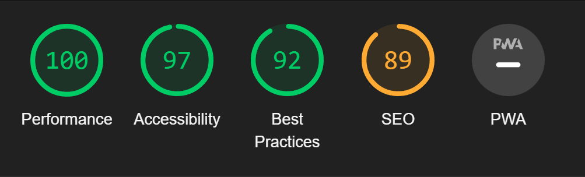
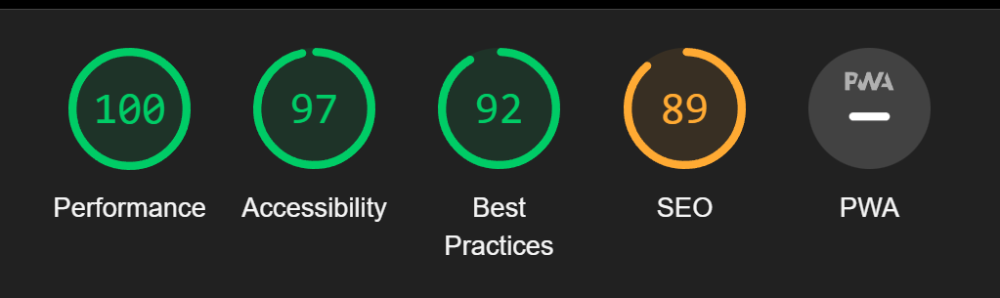
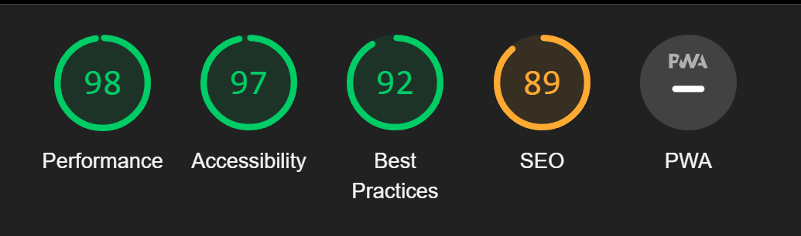
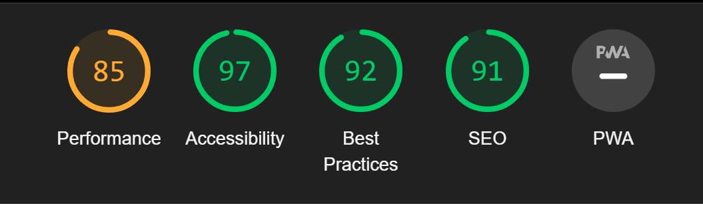
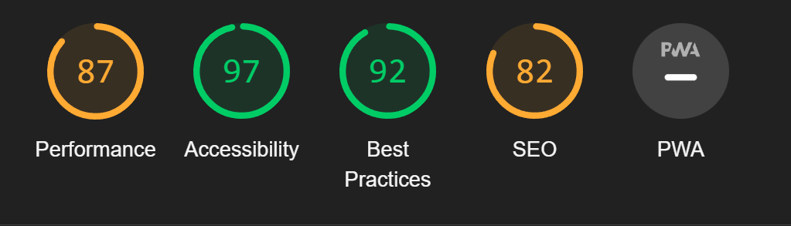
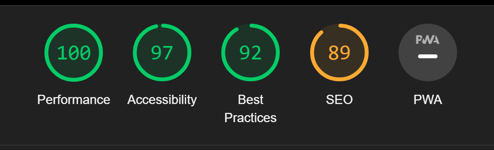
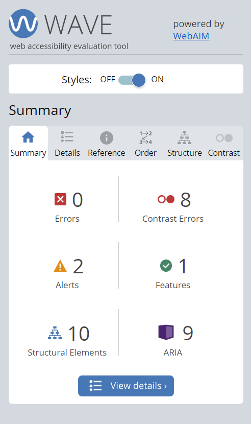

# **Rising Women Testing Results**


**[Link to the deployed/ live site](https://rising-women.herokuapp.com/)**

---
## TABLE OF CONTENTS

* [Automated Testing and Validation](#automated-testing-and-validation)
    * [HTML Validation](#html-validation)
    * [CSS Validation](#css-validation)
    * [JavaScript Validation](#javascript-validation)
    * [Python Validation](#python-validation)
    * [Lighthouse Report](#lighthouse-report)
        * [Desktop](#desktop)
        * [Mobile](#mobile)
    * [WAVE Web Accessibility Evaluation Tool](#wave-web-accessibility-evaluation-tool)
    * [Django Automated Testing](#django-automated-testing)
        * [Coverage](#coverage)
* [Manual Testing](#manual-testing)
    * [Testing User Stories](#testing-user-stories)
    * [Full Testing](#full-testing)
* [Bugs, Errors & Solutions](#bugs-found-during-testing-and-development-phase)
    * [Solved Bugs](#solved-bugs)
    * [Known Bugs](#known-bugs)
---

## Automated Testing and Validation
### HTML Validation
We used [W3C Markup Validation Service](https://validator.w3.org/) to validate all the HTML files by direct input:
|Page | Mobile |
| ------------- | ------------- |
| Index | |
| Register | |
| Login | |
| Logout | |

### CSS Validation
We used [W3C CSS Validation Service](https://jigsaw.w3.org/css-validator/) to validate all CSS files by direct input.

|Page | Mobile |
| ------------- | ------------- |
| Index | |
| Register | |
| Login | |
| Logout | |

### JavaScript Validation
We used [JSHint](https://jshint.com/) to validate all JavaScript and JQuery files
| Page | Result | Test Details & Screenshots |
| ---- | :-: | -------------------------- |
| [add-here-js-file-path] | [add-here-if-error-number] error and [add-here-if-warning-number] warning | [add-here-validation-image] |

### Python Validation
At the project inception, we installed [PyCodeStyle](https://pycodestyle.pycqa.org/en/latest/intro.html#configuration) in our workspace fixed errors when encountered throughout the development process. We also used [Code Institute's Python Linter](https://pep8ci.herokuapp.com/) to lint our Python code.

### Contact App
| File | Result |
| ---- | ---- |
| Contact Admin | |
| Contact App | |
| Contact Forms | |
| Contact Models | |
| Contact URLs | |
| Contact Views | |

### Home App
| File | Result |
| ---- | ---- |
| Home Apps | |
| Home Urls | |
| Home Views | |

### Mentor App
| File | Result |
| ---- | ---- |
| Mentor Admin | |
| Mentor Apps | |
| Mentor Models | |
| Mentor URLs | |
| Mentor Views | |

### Profiles App
| File | Result |
| ---- | ---- |
| Profile Admin | |
| Profile Apps | |
| Profile Models | |
| Profile URLs | |
| Profile Views | |


### Lighthouse Report
[Chrome DevTools' Lighthouse](https://developer.chrome.com/docs/lighthouse/overview/) was used to test the performance, accessibility, best practices and SEO of the site

### <u>Lighthouse</u>
|Page | Mobile  | Computer|
| ------------- | ------------- |------------- |
| Index | | 
| Register || 
| Sign In || 
| Logout || 
|


In order to fully validate the page, we used the WAVE Chrome extension. This enabled our team to test the pages that require user authentication.

| Page | WAVE This Page Result |
| ------------- | -------------
| Index | |
| Login | |
| Logout | |

### Django Automated Testing
For the automated testing, the writing and running of these tests used [Django's built in test module](https://docs.djangoproject.com/en/4.1/topics/testing/overview/). For each installed application, we created a folder called tests, added the ```__init__.py``` file and the separate files for testing the views, models and forms.

We also used coverage to generate the report and find out the percentage of statements that we were able to cover and those that we missed for every installed application. We tried to achieve as close to the 100% mark as we possibly can.

#### Coverage
| Installed App Coverage Report | Test | Cover in Percentage | Screenshot of Coverage Report |
| -- | :-: | :-: | :-: |
| mentors | test_models  | [add-here-overall-coverage-score-for-the-specific-app] | [test-models](./documentation/mentors-app-test-models.png) |
| mentors | test_views  | [add-here-overall-coverage-score-for-the-specific-app] | [test-models](./documentation/mentors-app-test-views-wip.png) |
| profiles | test_views  | [add-here-overall-coverage-score-for-the-specific-app] | [test-models](./documentation/profiles-test-views.png) |

## Manual Testing
### Testing User Stories
[copy-and-paste-below-user-stories]
### **User Stories**
| **User Story #** | **As a/an** | **I want to be able to...** | **So that I can...** | **How was this achieved** | **RESULT**
| :-- | :-- | :-- | :-- | :-- | :-- |
| As a user, I can click on Register button on Home Page so that I can navigate to Registration Page.  | PASS |
| As a user, in the Registration Page I can fill a form with my name, my surname, my e-mail address, my phone number so that I can create an account as a mentee. | PASS |
| As a user, I can click on Register button on Home Page so that I can navigate to Registration Page. | PASS |  
| As a user, in the Registration Page I can fill a form with my name, my surname, my e-mail address, my phone number so that I can create an account as a mentee. |  PASS |
| As a user, I can see some "Inspirational Women in Tech" so that I can have a better motivational aspect. | PASS |
| As a user, I can choose see a mentors skills so that I can find the right mentor for me. | PASS |
| As a user, I can reach the mentors on Linked in and Website after registration so that I can have communication ways with mentors.| PASS |
| As a user, I can visit mentor profiles by clicking on "view full profile" so that I can see their information , LinkedIn and website. | PASS   | 
| As a registered user, I can go to My Account and click "Edit My Profile" so that I can update my information.| PASS |
| As a user, I can click "Meet the hackathon team" button on Home Page so that I can have a better understanding about the people behind the product.| PASS |
| As a user, I can click on "Become a mentor" button on nav bar so that I can apply to be a mentor.| PASS |

| **VIEWING & NAVIGATION** |  |  |  |  |  |

### Full Testing
Full testing was conducted using the following physical devices:
* Mobile:
    * iPhone 14
    * iPhone 11 Pro
    * iPhone 6
* Tablet
    * iPad Pro
    * iPad mini (4th gen)
    * iPad 4
* Laptop
    * MacBook 2012
    * Macbook 2014
    * Alienware m17 r3
* Desktop
    * HP V27e FHD Monitor (27 inch)

| Feature | Expected Outcome | Testing Performed | Result | Pass/ Fail|
| :-- | :-- | :-- | :-- | :-- |
| **MENTOR EXPERTISE CATEGORIZATION** |  |  |  |  |
| [add-here-the-model-name] | [expected-outcome] | [testing-performed] | [result] | [pass-or-fail]

## Bugs, Errors and Solutions
### Solved Bugs
| # | Bugs, Errors and Issues | Solutions |
| :--- | :--- | :--- |
| `RelatedObjectDoesNotExist at /accounts/login/` error | A couple of users already exist before the profiles app was created and before thesignal was added, so when these users tried to login, the signal won't let them login since the username isn't new so it's trying to save the profiles which do not exist. | To fix this error, go to models.py on profiles app and temporarily adjust the signal by commenting out ```if created: instance.userprofile.save()``` and adjust the indentation for  `UserProfile.objects.create(user=instance)`. Then login as these existing users. After logging out, go back to models.py file in the profiles app and revert the adjustment made to signal. |
| 'FATAL too many connections for role' Port 5432 failed' | A database triggered when people wanted to sign up. After much investigation and testing the database was holding on to users when signing up so initially we were having to terminate the connections from ElephantSQL and eventually made signing up with an email optional. It is not "solved" as we have not found the absolute source - though we do know it is from using an email to sign up. We also are using the free version of Elephant SQL so our functionality on searching and solving the issue is limited. | To fix this we made emails optional in settings.py|  
### Known Bugs
| # | Known Bugs, Errors and Issues | Justification |
| :--- | :--- | :--- |